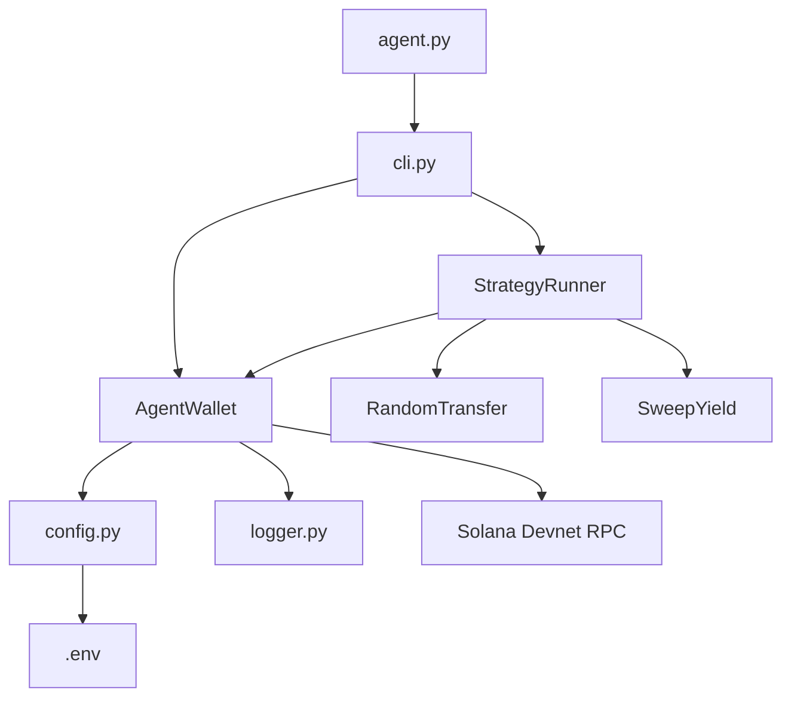

# 🎈 AutoYield Agent

**Weightless Solana Devnet automation.** An autonomous Python agent that manages its own wallet, funds itself, signs transactions, and executes pluggable yield strategies — all without human intervention.

```
import antigravity  # The vibe: effortless execution
```

---

## Quick Start

```bash
# 1. Install dependencies
pip install -r requirements.txt

# 2. (Optional) Set encryption passphrase
#    Copy .env.example → .env and set AUTOYIELD_PASSPHRASE
cp .env.example .env

# 3. Check status (creates wallet on first run)
python agent.py status

# 4. Fund the wallet via Devnet airdrop
python agent.py fund

# 5. Execute an autonomous strategy round
python agent.py run
```

---

## Architecture



| Module | Responsibility |
|---|---|
| `config.py` | Load env vars, validate Devnet-only, expose `Config` dataclass |
| `wallet.py` | Key management (encrypted), RPC connection, airdrop with retry, transfer signing |
| `strategies.py` | Pluggable `Strategy` protocol + built-in implementations |
| `logger.py` | Emoji-coded console output with timestamps and quiet mode |
| `cli.py` | `argparse` CLI: `run`, `status`, `fund`, `reset` |

---

## CLI Reference

| Command | Description | Key Flags |
|---|---|---|
| `status` | Print wallet address + balance | `--quiet` |
| `fund` | Request Devnet airdrop | `--quiet` |
| `run` | Hydrate + execute strategy loop | `--strategy`, `--rounds`, `--interval`, `--vault` |
| `reset` | Delete wallet key file | — |

### Examples

```bash
# Single random transfer round
python agent.py run

# 5 rounds of random transfers, 10s apart
python agent.py run --rounds 5 --interval 10

# Sweep excess to a vault
python agent.py run --strategy sweep --vault <BASE58_PUBKEY>

# Infinite loop, quiet mode
python agent.py run --rounds 0 --quiet

# Nuke and start fresh
python agent.py reset
```

---

## Security

- **Key encryption:** If `AUTOYIELD_PASSPHRASE` is set, the wallet key is encrypted at rest via Fernet (AES-128-CBC).
- **Devnet only:** `Config` rejects any RPC URL that doesn't contain `devnet`.
- **No mainnet exposure:** There are zero mainnet configurations in this project.

---

## Testing

```bash
# Unit tests (mocked RPC — no network needed)
python -m pytest tests/test_wallet.py -v

# Integration tests (live Devnet — requires network)
python -m pytest tests/test_harness.py -v --timeout=120
```

---

## Agent Framework Integration

See [SKILLS.md](SKILLS.md) for JSON schemas and integration examples for:
- **LangChain** `StructuredTool`
- **Fetch.ai** `uAgent`
- Any framework that consumes JSON skill descriptors

---

## License

MIT
